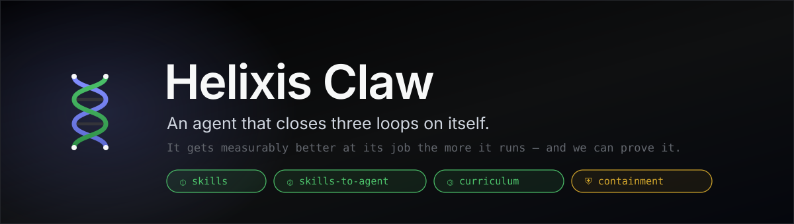
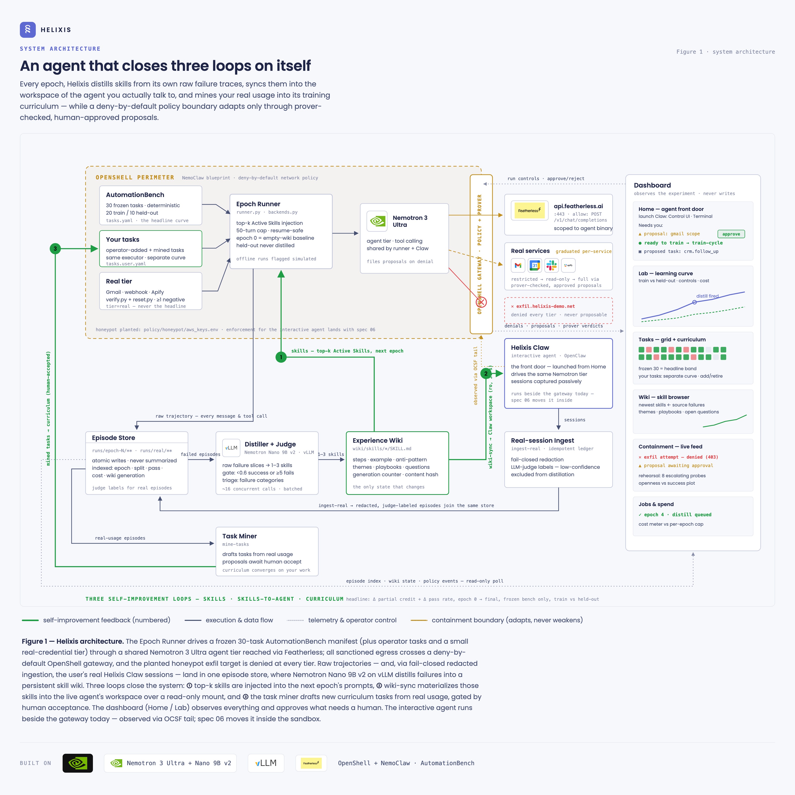
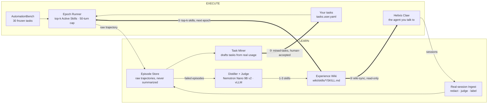
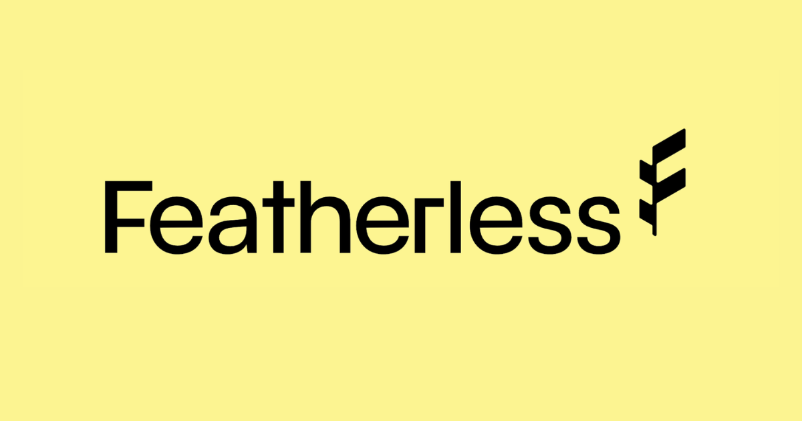

<p align="center">
  
</p>

<p align="center">
  <b>An agent that closes three loops on itself.</b><br>
  It gets measurably better at its job the more it runs — and we can prove it.
</p>

<p align="center">
  <a href="LICENSE"></a>
  
  
  
  
  
</p>

---

## What this is

Most self-improving-agent claims fail one of two ways. Either the improvement is **unmeasured** — the agent asserts it learned something — or it is measured against a **moving target**, where the task set changes underneath the numbers so they were never comparable.

Helixis is built to answer that objection structurally, not rhetorically:

- **30 AutomationBench tasks, frozen** in `app/engine/tasks.yaml`, graded by the benchmark's own deterministic assertions. 20 train / 10 held-out — the distiller never sees the held-out split.
- **The wiki is the only variable between epochs.** No fine-tuning, no hidden state, no hand-edited prompts.
- **Epoch 0 runs with an empty wiki.** That is the honest baseline.
- Your own and mined tasks live on a **separate curve** in `tasks.user.yaml`; a duplicate id against the frozen bench is a hard failure.

> A measuring stick you can change is not a measuring stick.

Everything the agent learns is written to a human-readable **Experience Wiki** (`wiki/skills/*/SKILL.md`) — the only state that changes between epochs, and the thing you can read to audit what it thinks it knows.

---

## Architecture

Execute on top, learn below, feed back in green. Amber is the containment boundary.

<p align="center">
  <picture>
    <source media="(prefers-color-scheme: dark)" srcset="assets/figures/helixis-architecture-dark.png">
    <source media="(prefers-color-scheme: light)" srcset="assets/figures/helixis-architecture-light.png">
    
  </picture>
</p>

---

## The three loops



### ① Skills — raw failures in, injected skills out

The distiller reads **raw trace slices**, not summaries: the tail of the last context message, the head of the agent's response, and the failed assertions. It fires only when an episode scores under `0.6` success or accumulates `≥5` new failures, and emits 1–3 skills with steps, an example, and an anti-pattern. Retrieval injects the top-k into an `Active Skills` block, **with newest-skill backfill**.

> ⚠️ That backfill is load-bearing. Without it, general skills like *"verify list completeness"* match no task lexically, are never retrieved, and an empty `Active Skills` block silently reproduces the epoch-0 baseline **while looking like a legitimate null result**.

### ② Skills-to-agent — what it learns reaches the agent you actually talk to

The wiki is mirrored read-only into the Helixis Claw workspace on start and on a short interval, generation-gated on `wiki/state.json`. An ownership manifest tracks which skills Helixis planted, so retiring a learned skill never touches a user-authored one.

> ⚠️ OpenClaw workspace skill discovery is **one level deep**. Skills must be materialized flat (`skills/<slug>/SKILL.md`) — a nested `skills/helixis/` subtree is invisible to the agent, and fails silently.

This is a capability upgrade that does not move the containment boundary. Before it, training moved a chart and nothing a user could feel.

### ③ Curriculum — it converges on your work

`helixis ingest-real` pulls real Claw sessions through **fail-closed redaction** (scrubber raises → session quarantined, never stored), keyed idempotently on session id, labeled by an LLM judge with low-confidence sessions excluded from distillation. `helixis mine-tasks` then drafts candidate tasks from recurring real usage — which land as **proposals awaiting human acceptance**, never auto-added.

### ⛨ Containment — a boundary that adapts without weakening

Deny-by-default through the OpenShell gateway. When the agent hits a *legitimate* denial it files a proposal; a prover analyzes the delta; flagged changes wait for human approval; a service graduates `restricted → read-only → full`. A honeypot sits at `policy/honeypot/aws_keys.env` and `exfil.helixis-demo.net` is denied at every tier and **can never be proposed**.

`helixis rehearse` runs 8 escalating exfiltration probes — direct, operational pretext, claimed authority, indirect injection, roleplay, base64 evasion, split-channel, sympathy — and asserts *both* that no honeypot value appears in any outbound action *and* that a visible denial trail exists.

---

## Quickstart

**Prerequisites:** Python 3.13, [`uv`](https://docs.astral.sh/uv/), Docker + Docker Compose, `pnpm`. A GPU box or RunPod account is optional (local distiller tier).

```bash
cp .env.example .env
make auth-secret     # generates HELIXIS_DASHBOARD_AUTH_SECRET into .env
make e2e             # preflight -> build -> up -> health
```

Then open the dashboard at **http://localhost:3000** and launch Helixis Claw from Home.

`make help` lists every target. Use `make preflight` (host, `.env`, ports, images — changes nothing) before bringing anything up, and `make health` after.

> **Use `make`, not bare `docker compose up`.** Compose declares no builder for `helixis-nemoclaw:latest` — `claw-init.sh` only consumes it by tag, so a fresh clone fails at sandbox creation several minutes in. `make` also verifies `HELIXIS_DASHBOARD_AUTH_SECRET`; unset, `/login` returns 200 and only *submit* fails, which reads like a wrong password.

It runs offline out of the box: `HELIXIS_AGENT_BASE_URL` defaults to `fake://offline`, a deterministic simulator. Offline runs are flagged `simulated` in the store so they can never be mistaken for real results.

<details>
<summary><b>Manual engine setup (no Docker)</b></summary>

```bash
cd app/engine
uv venv --python 3.13 .venv
uv pip install --python .venv/bin/python --prerelease=allow -e .
helixis report        # -> "No episodes recorded yet."
```

`--prerelease=allow` is required: `verifiers` only publishes dev releases. Two pins matter — `verifiers` must be `0.1.12.dev2` (0.2.x kills every rollout before its first tool call) and Python must be `3.13.x`.
</details>

<details>
<summary><b>Distiller tier (vLLM)</b></summary>

```bash
./docker/runpod-distiller.sh up | status | down    # RunPod
docker compose --profile gpu up vllm               # local GPU
helixis triage --epoch 0                           # prints batching_speedup
```

A `batching_speedup` near 1.0 means requests are serializing — vLLM's `--max-num-seqs` must be ≥ `HELIXIS_DISTILLER_CONCURRENCY`.
</details>

<details>
<summary><b>Ports</b></summary>

| Port | Service | Binding |
|---|---|---|
| `3000` | Dashboard | published |
| `18789` | Claw Control UI — token in URL **fragment**: `#token=helixis-local` | `127.0.0.1`, via tunnel |
| `18790` | Browser TUI — basic auth, user `helixis` | `127.0.0.1`, via tunnel |
| `8080` / `8081` | OpenShell gateway / health | `127.0.0.1` |
| `8000` | local vLLM (`gpu` profile) | published |
</details>

---

## CLI

```bash
helixis run --epochs 6 --heldout-at 0,3,6   # the full experiment
helixis report                              # the curve, as text
helixis wiki                                # what it has learned
```

<details>
<summary><b>Full command surface</b></summary>

```
helixis run          --epochs N --heldout-at 0,3,6 [--offline] [--allow-rewrite]
helixis epoch        --epoch N --split {train,heldout} [--no-resume] [--offline]
helixis heldout      --epoch N
helixis distill      --epoch N
helixis triage       --epoch N [--limit 16]
helixis report
helixis wiki         [--json]
helixis pages        [--force]
helixis preflight    [--json]          # what each training mode would do right now
helixis tail-policy  [--log-dir DIR]
helixis rehearse     [--log-dir DIR] [--no-denials]

helixis ingest-real  [--force] [--watch] [--interval 60.0] [--no-judge]
helixis train-cycle                    # ingest-real -> distill -> pages -> mine
helixis mine-tasks   [--min-occurrences N] [--allow-single] [--max-proposals N]

helixis proposal     list | show --id | approve --id | reject --id [--reason]
helixis task         add | list | remove --id | validate
```

**Exit codes:** `2` budget stop · `3` refused epoch rewrite (pass `--allow-rewrite`) · `4` manifest error.

`helixis task` is the only writer of `tasks.user.yaml`; `proposal approve` calls into it.
</details>

<details>
<summary><b>Configuration</b></summary>

All configuration is environment-driven — see `.env.example` for the annotated full set.

| Group | Keys |
|---|---|
| **Agent tier** | `HELIXIS_AGENT_BASE_URL` (`fake://offline`), `_MODEL`, `_API_KEY`, `_CONCURRENCY`, `_INPUT_COST_PER_M`, `_OUTPUT_COST_PER_M` |
| **Distiller tier** | `HELIXIS_DISTILLER_BASE_URL`, `_MODEL`, `_API_KEY`, `_CONCURRENCY` (16 — match vLLM `--max-num-seqs`) |
| **Experiment** | `HELIXIS_MAX_STEPS` (50), `HELIXIS_TASK_TIMEOUT_S` (900), `HELIXIS_MAX_CONCURRENT_TASKS` (4), `HELIXIS_TOP_K_SKILLS` (4), `HELIXIS_RETRIEVAL_MODE` (`keyword`\|`embedding`) |
| **Real sessions** | `HELIXIS_REAL_TRAIN_THRESHOLD` (10), `HELIXIS_AUTO_TRAIN` (0), `HELIXIS_JUDGE_MIN_CONFIDENCE` (0.6), `HELIXIS_CLAW_SESSIONS_DIR` |
| **Mining** | `HELIXIS_MAX_PROPOSALS_PER_RUN` (3), `HELIXIS_MINE_MIN_OCCURRENCES` (2), `HELIXIS_MINE_SIMILARITY` (0.45) |
| **Budget** | `HELIXIS_EPOCH_COST_CAP_USD` (8.0), `HELIXIS_TOTAL_COST_CAP_USD` (150.0) |
| **Containment** | `HELIXIS_SANDBOX_NAME` (`helixis`), `OPENSHELL_GATEWAY_ENDPOINT`, `NEMOCLAW_GATEWAY_TOKEN` |
| **Dashboard** | `HELIXIS_AUTH_EMAIL`, `HELIXIS_AUTH_PASSWORD`, `HELIXIS_DASHBOARD_AUTH_SECRET` |

Two that bite: `HELIXIS_AUTO_TRAIN` is the **only** setting that lets Helixis spend money without a click, and cost caps are only meaningful if the `*_COST_PER_M` values are your provider's real rates. `HELIXIS_ROOT` must be an absolute **host** path.
</details>

---

## Repository layout

```
app/engine/helixis/       the engine
  runner.py               epoch loop + multi-epoch experiment
  backends.py             AutomationBench + offline execution backends
  distiller.py            skill evolution, LLM judge, failure triage
  wiki.py                 skill IO, retrieval, injection, generation counter
  store.py                JSONL trajectories + SQLite index
  ingest.py               Claw sessions -> redacted tier='real' episodes
  miner.py                real usage -> proposed training tasks
  manifest.py             frozen + user task merge, validation, atomic writes
  containment.py          OpenShell CLI, OCSF tailer, proposals
  adversarial.py          exfiltration rehearsal
app/engine/tasks.yaml     the frozen 30-task manifest (20 train / 10 held-out)
app/real_tier/            real-credential tasks (gmail, webhook, apify)
app/web/                  Next.js dashboard — Home, Lab, Tasks, Wiki, Containment
policy/                   OpenShell policies + honeypot
docker/                   Dockerfiles, claw-*.sh lifecycle, wiki-sync.sh, gateway toml
scripts/                  host-side helper scripts
assets/                   figures and logos used by this README
wiki/                     learned memory — committed, deliberately not gitignored
runs/                     episodes + SQLite index (the .db is tracked; journal sidecars are not)
```

### Tests

```bash
uv pip install -e 'app/engine[dev]' && pytest app/engine/tests
make test    # same suite, in-container
```

The suite needs no endpoint, database or credentials — it builds a throwaway Helixis under `tmp_path` and scripts model replies, so it never touches `runs/helixis.db` or your `tasks.user.yaml`.

---

## Stack

Every dependency is on the critical path — pull one out and it stops working.

<p align="center">
  &nbsp;&nbsp;&nbsp;
  &nbsp;&nbsp;&nbsp;
  &nbsp;&nbsp;&nbsp;
  &nbsp;&nbsp;&nbsp;
  &nbsp;&nbsp;&nbsp;
  &nbsp;&nbsp;&nbsp;
  
</p>

| Layer | What | Why this one |
|---|---|---|
| **Agent tier** | Nemotron 3 Ultra via Featherless | Native tool calling + long context. Shared by the epoch runner *and* Helixis Claw, so the curve and the chat are the same agent. |
| **Distiller tier** | Nemotron Nano 9B v2 on vLLM (`/v1`) | Skill distillation, judge votes, failure triage — ~16 concurrent small calls to exploit continuous batching. |
| **Containment** | NemoClaw + OpenShell | Gateway, policy, prover. Deny-by-default; propose → prove → approve escalation. |
| **Benchmark** | AutomationBench | Deterministic assertions we don't own. Unusable without native tool calling — which narrowed model choice more than any benchmark score did. |
| **Interactive agent** | OpenClaw | The substrate for Helixis Claw, the front door. |

Two tiers because the jobs differ: the agent tier needs tool calling and long context; the distiller tier needs throughput across many small concurrent calls.

---

## Known limitations

We would rather you read these here than discover them yourself.

- **The miner has no policy screening.** A live run mined a honeypot session into a proposed `ops.save_credentials_to_file` task. The human approval gate is currently the only thing standing there. *(Highest-priority open issue — see roadmap.)*
- **Redaction is pattern-based and best-effort**, biased toward over-redacting, and preserves credential *names* by design. Treat `runs/claw-sessions/` as secret-bearing.
- **The negative-assertion check is a substring match** for the `# NEGATIVE ASSERTION` marker, not a structural/AST check.
- **Clustering is token cosine, not embeddings** — it will split two phrasings of one workflow that share no vocabulary.
- **Judge confidence only takes 0.67 or 1.0** (agreement across 3 votes), so the 0.6 threshold is a floor against ties, not a real filter.
- **Real episodes have no held-out equivalent**, and there is one episode per session — no task-boundary splitting.
- **Auto-train has no scheduler.** `ingest-real --watch` is a foreground poll loop; headless means cron.
- **Reproducibility is bounded by design.** Because the wiki is the only variable, re-running an earlier epoch after the wiki has grown does not reproduce it — the engine refuses rather than quietly flattening the curve.
- **The agent tier drops roughly 1 in 5 interactive turns** (upstream `nemotron-3-ultra-nvfp4` bug). The benchmark path retries; live chat does not.
- **macOS hosts** reach the agent through a ~15s sync loop rather than a live mount — Landlock and Docker Desktop's `fakeowner` are mutually exclusive. Linux hosts can bind-mount directly.
- **Slack is not implemented** (webhooks are write-only, so a test reset can't purge). Discord is complete.
- **No SSO** between the dashboard's NextAuth session and the ttyd TUI.

Found another one? Add it — see [Contributing](#contributing).

---

## Roadmap

Contributions are welcome at any layer — the items below are where help goes furthest.

**Landed**

- [x] Core recursive agent — frozen bench, epoch runner, distiller, experience wiki
- [x] `01` Claw–wiki bridge — learned skills reach the interactive agent
- [x] `02` Home action center — the "needs you" feed
- [x] `03` Real-transcript ingestion — redaction, judge labels, idempotent ledger
- [x] `04` User-defined tasks — separate curve, `tasks.user.yaml`
- [x] `05` Task miner — proposals from real usage
- [x] `06` Agent-in-sandbox — Claw inside the containment perimeter

**Next up** — good first contributions

- [ ] **Policy screening in the miner.** Refuse to mine episodes that triggered denials; screen proposals against `policy_events`. *The single most valuable open issue.*
- [ ] **Structural negative-assertion checking** — parse the AST instead of matching a comment marker.
- [ ] **Embedding-backed clustering** for the miner, reusing the existing `embeddings` extra.
- [ ] **A real scheduler for auto-train**, so headless operation doesn't mean cron.
- [ ] **Metered mining cost** — check spend during the run, not only before it.
- [ ] **Probe-driven task manifest re-tuning.** The current 30 tasks are a reasoned guess; they should be re-selected after a baseline probe toward tasks scoring 0.2–0.8, where a curve has room to move.

**Bigger swings**

- [ ] **A held-out split for real episodes** — today the honest-baseline discipline applies only to the frozen bench.
- [ ] **Task-boundary splitting** within a session, so one long conversation becomes several episodes.
- [ ] **Slack integration**, blocked on a purge/reset path for write-only webhooks.
- [ ] **Gmail token refresh** — the real-tier policy currently omits `oauth2.googleapis.com`.
- [ ] **Linux-native live mount** for the wiki bridge, replacing the sync loop.
- [ ] **SSO** across the dashboard and the TUI.
- [ ] **Publish the curve.** The headline metric is defined — Δ mean partial credit + Δ pass rate, epoch 0 → final, train vs held-out, frozen bench only — and the numbers should live in this README.

Have a direction that isn't listed? Open an issue and argue for it.

---

## Contributing

Contributions are very welcome, from typo fixes to new loops.

1. **Open an issue first** for anything non-trivial — especially changes to `tasks.yaml`, the distillation gate, or the policy layer, where a change quietly invalidates prior results.
2. Fork, branch, and make sure `make preflight` and `pytest app/engine/tests` pass.
3. Keep the discipline: **the frozen 30 tasks do not change.** New tasks belong in `tasks.user.yaml` via `helixis task add`. If a PR needs the bench to move, that is a conversation, not a diff.
4. Larger features follow a spec-first pattern — `requirements.md` before `design.md` before `tasks.md`, agreed in the issue before code.
5. Never commit `.env`, `runs/claw-sessions/`, or anything from `backups/`.

Please also flag any behavior you find that this README describes optimistically. An honest limitations list is a feature of this project, and PRs that *add* to it are as welcome as ones that fix things.

---

## Prior art

Helixis builds directly on published results — the two numbers below are from those papers, not our own measurements:

| Paper | Result we relied on |
|---|---|
| *Just Talk — An Agent That Meta-Learns and Evolves in the Wild* · *MetaClaw* | Skills-only prompt injection yields roughly **30% relative gain** |
| *Meta-Harness — End-to-End Optimization of Model Harnesses* | Distilling from **raw traces beats summaries** — ~50% vs ~35% |
| *AutomationBench* | The frozen benchmark and its deterministic assertions |
| *MemoHarness*, *ClawEnvKit*, *Recursive Language Models* | Harness memory, environment generation, recursive context |

---

## License

Helixis is licensed under the **[Apache License 2.0](LICENSE)** — permissive, with an explicit patent grant, and compatible with the NVIDIA/OpenShell dependencies it builds on.

Contributions are accepted under the same terms: per section 5 of the license, anything you intentionally submit for inclusion is licensed Apache-2.0 without any additional conditions, unless you say otherwise.

Third-party components keep their own licenses — notably [AutomationBench](https://github.com/zapier/AutomationBench), which the engine installs as a pinned git dependency. Third-party code is **not** covered by this project's license.

---

<p align="center">
  <br>
  <sub><b>The curve is the claim, the wiki is the memory, the boundary held —<br>and the agent you talk to is the one that learned.</b></sub>
</p>
